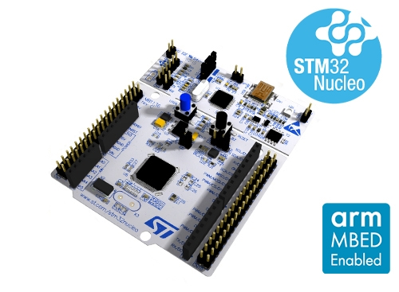
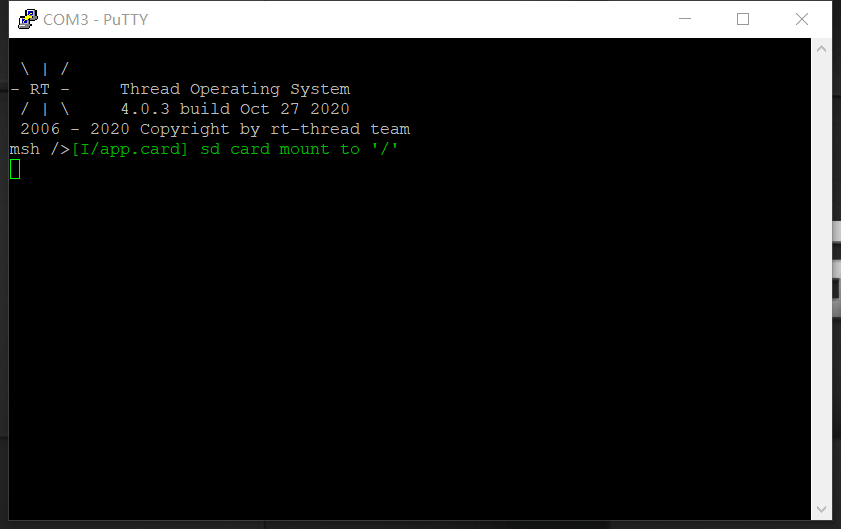

# STM32 Nucleo-64 BSP Introduction

This document records the guide of the BSP (board support package) provided by the RT-Thread development team for the STM32 Nucleo-64 development boards.

The document is covered in three parts:

-  Resources Introduction
- Quickly Get Started
- Advanced Features

By reading the ***Quickly Get Started*** section developers can quickly get their hands on this BSP and run RT-Thread on the board. More advanced features will be introduced in the Advanced Features section to help developers take advantage of RT-Thread to drive more on-board resources.


## Resources Introduction

The STM32 Nucleo-64 development boards are produced by ST official for STM32 series. 

The STM32 Nucleo-64 boards provide an affordable and flexible way for users to try out new concepts and build prototypes by choosing from the various combinations of performance and power consumption features, provided by the STM32 microcontroller. For the compatible boards, the external SMPS significantly reduces power consumption in Run mode.

### **For more details about these boards, please refer to [ST Nucleo official website](https://www.st.com/en/evaluation-tools/stm32-nucleo-boards.html?querycriteria=productId=LN1847).**

[](figures/stm32-nucleo-64.jpg)

The mainly-used resources of this board are shown as follows:

- Common-used peripherals:
  - 3 LEDs: USB communication (LD1), user LED (LD2), power LED (LD3) 
  - 2 Buttons: USER and RESET 
- Common-used interfaces: USB, Arduino Uno interface, and ST morpho
- Debug interface: ST-LINK/V2-1 


## Quickly Get Started

This BSP provides MDK4, MDK5, and IAR projects for developers and it supports the GCC development environment. Here's an example of the MDK5 development environment, to introduce how to run the system.

### Hardware connection

Use a Type-A to Mini-B cable to connect the development board to the PC and turn on the power switch. The LD3 (PWR) and LD1 (COM) will light.

### Compile and Download

- Double-click the `project.uvprojx` file to open the MDK-Keil5 project  (**NOT** `template.uvprojx` file)
- Click the “option for target” button
  - Debug: Choose "ST-LINK Debugger" and Click "Setting" button:
    - Port: choose "SW (Serial Wire)"
    - Flash Download: check "Reset and Run"

- Compile and download the program to the board

### Running Results

After the program is successfully downloaded, the system runs automatically. Observe the running results of the LED on the development board, the LD3 and LD1 will light all the time, and LD2 will flash periodically.

The USB virtual COM port connects to **USART2 by default**, and when the corresponding serial port (**115200-8-1-N**) is opened in the terminal tool, the output information of RT-Thread can be seen when the device is reset:

```shell
 \ | /
- RT -     Thread Operating System
 / | \     4.0.0 build Dec 21 2018
 2006 - 2018 Copyright by rt-thread team
msh >
```

### Terminal tool - PuTTy 

If you have no terminal tool software available, you can download *PuTTy*:

>  https://www.chiark.greenend.org.uk/~sgtatham/putty/latest.html




These two videos will show you how to use PuTTy:

> https://www.youtube.com/watch?v=ab4ilbsteWU
>
> https://www.youtube.com/watch?v=dO-BMOzNKcI


## **Advanced Features**

This BSP only enables GPIO and USART2 by default. If you need more advanced features such as SPI, I2C, you need to configure the BSP with RT-Thread [ENV tool](https://www.rt-thread.io/download.html?download=Env) , as follows:

1. Open the ENV tool under the specific BSP folder;
2. Enter `menuconfig` command to configure the project, then save and exit;
3. Enter `pkgs --update` command to update the package;
4. Enter `scons --target=mdk4/mdk5/iar` command to regenerate the project.

Learn how to use RT-Thread ENV, click [Here](https://github.com/RT-Thread/rtthread-manual-doc/blob/master/env/env.md).


## Maintained By

Meco Man @ RT-Thread Community

jiantingman@foxmail.com 

https://github.com/mysterywolf