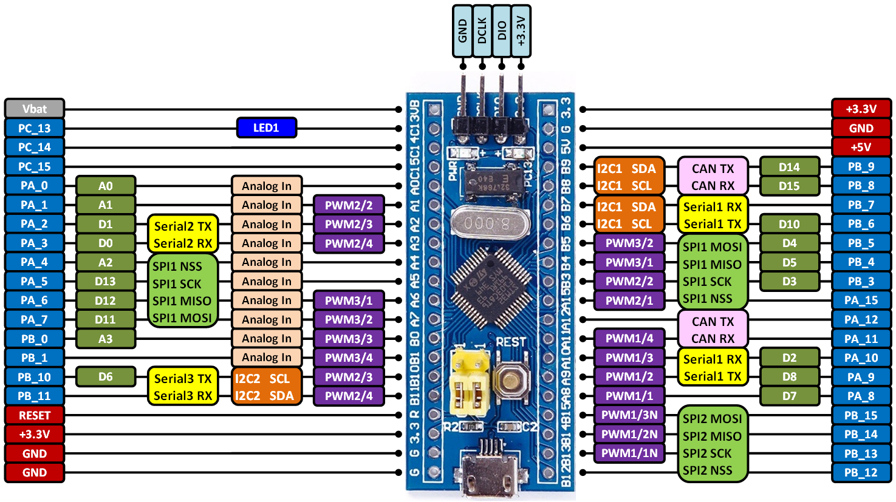
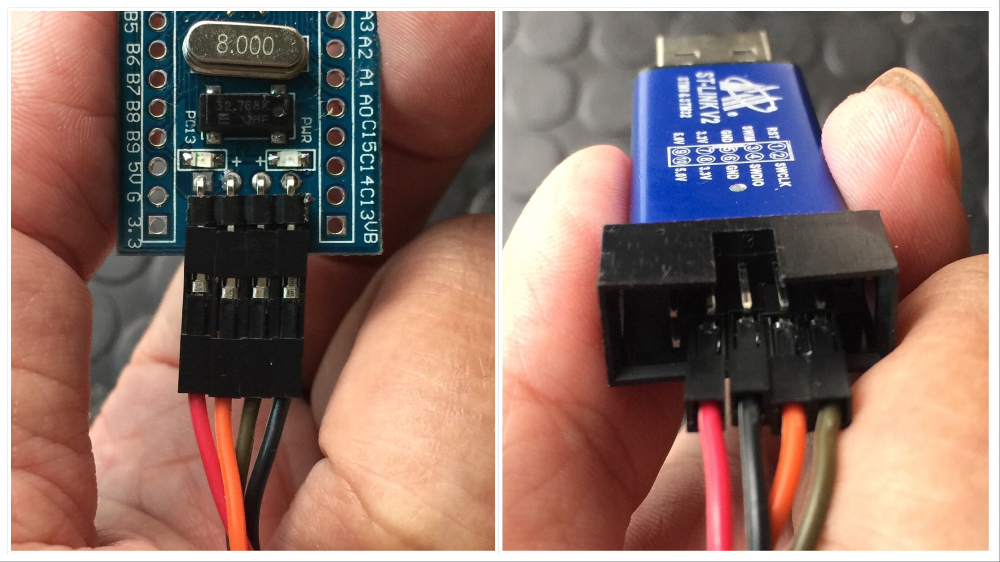
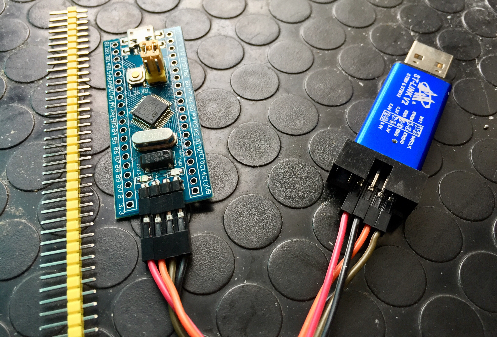
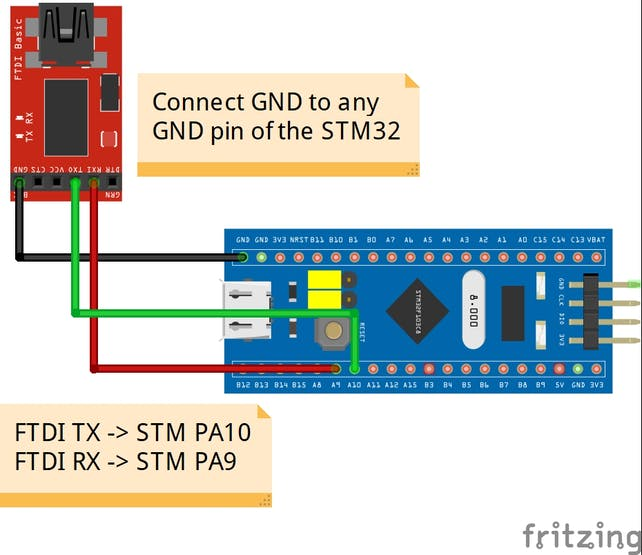

# STM32F103C8 Blue Pill Board BSP Introduction

 [[中文]](README_zh.md)

This document records the introduction of the BSP (board support package) provided by the RT-Thread development team for the STM32F103C8 Blue Pill development board.

The document is covered in four parts:

- Onboard Resources
- Quickly Get Started
- Advanced Features
- Read more

By reading the ***Quickly Get Started*** section developers can quickly get their hands on this BSP and run RT-Thread on the board. More advanced features will be introduced in the Advanced Features section to help developers take advantage of RT-Thread to drive more on-board resources.


## Onboard Resources

The Blue Pill is a STM32F103 based development board with Cortex-M3 ARM CPU that runs at 72 MHz, 20 KB of RAM and 64 or 128 KB of flash memory. The microcontroller (MCU) has a USB port, two serial ports, 16 bit PWM pins and 12 bit ADC pins. It runs at 3.3V, but some of its pins are 5V tolerant.

- MCU：STM32F103C8T6 @72MHz, 64KB FLASH , 20KB RAM

- Peripherals
  
  - LED：PC13
  
- Debug IO interface type: ST-LINK V2 (SWD)





## Quickly Get Started

This BSP provides MDK4, MDK5, and IAR projects for developers and it supports the GCC development environment. Here's an example of the MDK5 development environment, to introduce how to run the system.

### Use ST-LINK Debugger to connect the Blue Pill Board

ST-LINK driver: https://www.st.com/en/development-tools/stsw-link009.html

| ST-LINK Debugger | Blue Pill 4-Pin SWD |
| :--------------: | :-----------------: |
|      SWDIO       |         IO          |
|      SWDCLK      |         CLK         |
|      VCC3.3      |       VCC3.3        |
|       GND        |         GND         |







### Use FTDI adapter(USB to UART) to connect the Blue Pill Board's PA9(Tx) and PA10(Rx) pins

FTDI adapter driver: https://www.ftdichip.com/FTDrivers.htm

You can use other USB to UART adapters to replace FTDI adapter.

| FTDI adapter(USB to UART) |            Blue Pill Board            |
| :-----------------------: | :-----------------------------------: |
|            Tx             |                PA10 Rx                |
|            Rx             |                PA9 Tx                 |
|            GND            |                  GND                  |
|          VCC 3.3          | **Don't need to connect VCC 3.3 pin** |
|           VCC 5           |  **Don't need to connect VCC 5 pin**  |





### Make sure Jumper Position (Both 0 Position)

| BOOTx | High / Low |
| :---: | :--------: |
| BOOT0 |     0      |
| BOOT1 |     0      |


### Compile and Download

- Double-click the `project.uvprojx` file to open the MDK5 project  (**NOT** `template.uvprojx` file)
- Click the “option for target” button
  - Debug: Choose "ST-LINK Debugger" and Click "Setting" button:
    - Port: choose "SW (Serial Wire)"
    - Flash Download: check "Reset and Run"

- Compile and download the program to the board


### Running Results

After the program is successfully downloaded, the system runs automatically. Observe the running results of the LED on the development board, and you will see the LED is flashing periodically.

The USB virtual COM port connects to **USART1 (PA9-Tx, PA10-Rx) by default**, and when the corresponding serial port (**115200**-8-1-N) is opened in the terminal tool, the output information of RT-Thread can be seen when the device is reset:

```shell
 \ | /
- RT -     Thread Operating System
 / | \     4.0.0 build Dec 21 2018
 2006 - 2018 Copyright by rt-thread team
msh >
```

- If you have no terminal tool software available, you can download *Putty*: https://www.chiark.greenend.org.uk/~sgtatham/putty/latest.html


## **Advanced Features**

This BSP only enables GPIO and USART1 by default. If you need more advanced features such as SPI, ADC, or to add software packages, you need to configure the BSP with RT-Thread [ENV tools](https://www.rt-thread.io/download.html?download=Env), as follows:

1. Open the ENV tool under the specific BSP folder, eg: *bsp/stm32/stm32f103-blue-pill* ;
2. Enter `menuconfig` command to configure the project, then save and exit;
3. Enter `pkgs --update` command to update the package;
4. Enter `scons --target=mdk4/mdk5/iar` command to regenerate the project.

Learn how to use RT-Thread ENV, click [Here](https://github.com/RT-Thread/rtthread-manual-doc/blob/master/env/env.md).


## Read more

- [[Schematic]](https://stm32duinoforum.com/forum/images/c/c1/wiki_subdomain/Vcc-gnd.com-STM32F103C8-schematic.pdf)
- [[STM32 Blue Pill vs Black Pill Microcontroller Boards]](https://www.youtube.com/watch?v=QCdnO43RBK4&t=875s)
- [[STM32F103C8 datasheet]]( https://www.st.com/resource/en/datasheet/stm32f103c8.pdf)
- [[STM32F103C8 More Information]](https://www.st.com/en/microcontrollers-microprocessors/stm32f103c8.html#overview)


## Maintained By

Meco Man @ RT-Thread Community

jiantingman@foxmail.com 

https://github.com/mysterywolf